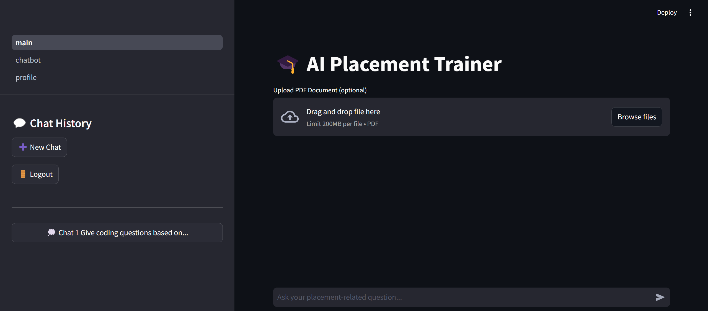

# 🎓 AI Placement Trainer Chatbot

A sophisticated AI-powered chatbot designed to assist students with placement-related queries, preparation strategies, and company-specific information.



## 📌 Overview

The AI Placement Trainer is an intelligent assistant built to help students navigate the complex world of campus placements. Leveraging advanced LLM technologies, document processing capabilities, and real-time web search, this chatbot provides personalized guidance for career preparation.

### Key Features

- 🤖 **AI-Powered Responses** - Uses Llama 3.1 8B via Groq API for fast, accurate responses
- 📑 **Document Processing** - Upload company PDFs for context-aware conversations
- 🔍 **Web Search Integration** - Real-time information retrieval via Tavily API
- 💾 **Conversation Memory** - Stores and retrieves chat history through semantic search
- 🔐 **User Authentication** - Secure login system using Supabase

## 🖼️ Screenshots

<div align="center">
  <div style="display: flex; flex-wrap: wrap; justify-content: center; gap: 20px;">
    <div style="display: flex; flex-direction: column; align-items: center;">
      
      <p style="margin-top: 8px; text-align: center;">
        <strong>Login Screen</strong> - Secure authentication interface for returning users
      </p>
    </div>
    <div style="display: flex; flex-direction: column; align-items: center;">
      
      <p style="margin-top: 8px; text-align: center;">
        <strong>Signup Screen</strong> - New user registration form with email verification
      </p>
    </div>
    <div style="display: flex; flex-direction: column; align-items: center;">
      
      <p style="margin-top: 8px; text-align: center;">
        <strong>Chat Interface</strong> - Interactive AI conversation with placement-specific responses
      </p>
    </div>
    <div style="display: flex; flex-direction: column; align-items: center;">
      
      <p style="margin-top: 8px; text-align: center;">
        <strong>Document Upload</strong> - PDF processing interface for company-specific information
      </p>
    </div>
  </div>
</div>

## 🛠️ Technologies Used

- **Frontend**: Streamlit
- **LLM**: Groq (Llama 3.1 8B)
- **Embeddings**: Hugging Face (E5-large-v2)
- **Vector Database**: Qdrant
- **Authentication & Storage**: Supabase
- **Web Search**: Tavily API

## 🚀 Getting Started

### Prerequisites

- Python 3.8+
- Streamlit
- API keys for:
  - Groq
  - Tavily
  - Qdrant
  - Supabase
  - Hugging Face

### Installation

1. Clone the repository:
   ```bash
   git clone https://github.com/username/ai-placement-trainer.git
   cd ai-placement-trainer
   ```

2. Install required packages:
   ```bash
   pip install -r requirements.txt
   ```

3. Create a `.env` file with your API keys:
   ```
   GROQ_API_KEY=your_groq_api_key
   TAVILY_API_KEY=your_tavily_api_key
   QDRANT_URL=your_qdrant_url
   QDRANT_API_KEY=your_qdrant_api_key
   SUPABASE_URL=your_supabase_url
   SUPABASE_KEY=your_supabase_key
   HF_TOKEN=your_huggingface_token
   ```

4. Run the application:
   ```bash
   streamlit run app.py
   ```

## 💡 Usage

### User Registration & Login
1. Create an account with a valid email and secure password
2. Login with your credentials

### Chat Interface
1. Ask placement-related questions
2. Upload company PDFs for context-aware responses
3. Navigate between different chat sessions

### Document Processing
- Upload company PDFs, job descriptions, or placement materials
- The system will process and index the content for reference
- Ask specific questions about the uploaded content

## 🔧 Core Functionality

### RAG (Retrieval Augmented Generation)
The system combines three sources of information to generate responses:
1. Uploaded document context
2. Real-time web search results
3. Previous conversation history

### Authentication
- Secure email/password authentication
- Password requirements include minimum length and character variety
- Session management with Supabase

### Vector Search
- Document chunks and conversation history are embedded and stored in Qdrant
- Semantic search retrieves relevant information based on query similarity

## 📊 Architecture

```
┌─────────────────┐     ┌───────────────┐     ┌─────────────────┐
│  User Interface │     │ Authentication │     │  File Upload    │
│    (Streamlit)  │────▶│   (Supabase)   │     │     Handler     │
└─────────────────┘     └───────────────┘     └────────┬────────┘
         │                                             │
         │                                             ▼
         │                                    ┌─────────────────┐
         │                                    │  PDF Processing │
         │                                    │  & Embedding    │
         │                                    └────────┬────────┘
         ▼                                             │
┌─────────────────┐                                    │
│  User Query     │                                    │
│   Processing    │                                    │
└────────┬────────┘                                    │
         │                                             │
         ▼                                             ▼
┌─────────────────┐     ┌───────────────┐     ┌─────────────────┐
│  Web Search     │     │ Vector Search │     │  Document Store  │
│    (Tavily)     │────▶│   (Qdrant)    │◀────│     (Qdrant)     │
└────────┬────────┘     └───────┬───────┘     └─────────────────┘
         │                      │
         │                      │
         ▼                      ▼
┌─────────────────────────────────────────────┐
│                                             │
│           LLM Response Generation           │
│              (Groq/Llama 3.1)               │
│                                             │
└────────────────────┬────────────────────────┘
                     │
                     ▼
┌─────────────────────────────────────────────┐
│                                             │
│              Response Storage               │
│        (Supabase + Qdrant Embedding)        │
│                                             │
└─────────────────────────────────────────────┘
```

## 🔒 Privacy and Security

- API keys are stored securely and never exposed to the frontend
- User passwords are hashed and secured through Supabase
- Chat histories are associated with specific user accounts

## 🛣️ Roadmap

- [ ] Add resume analysis capabilities
- [ ] Implement interview simulation feature
- [ ] Enable company-specific preparation modules
- [ ] Add multi-language support
- [ ] Develop mobile application

## 🤝 Contributing

Contributions are welcome! Please feel free to submit a Pull Request.

1. Fork the repository
2. Create your feature branch (`git checkout -b feature/amazing-feature`)
3. Commit your changes (`git commit -m 'Add some amazing feature'`)
4. Push to the branch (`git push origin feature/amazing-feature`)
5. Open a Pull Request

## 👥 Contributors

<div align="center">
  <a href="https://github.com/mohithn2004">
    
  </a>
  &nbsp;&nbsp;&nbsp;&nbsp;
  <a href="https://github.com/Rijo-1">
    
  </a>
  &nbsp;&nbsp;&nbsp;&nbsp;
  <a href="https://github.com/sandyyman">
    
  </a>
</div>


## 🙏 Acknowledgements

- [Streamlit](https://streamlit.io/) for the web interface
- [Groq](https://groq.com/) for LLM API
- [Qdrant](https://qdrant.tech/) for vector storage
- [Supabase](https://supabase.io/) for authentication and data storage
- [Tavily](https://tavily.com/) for web search API
- [Hugging Face](https://huggingface.co/) for E5 embeddings


---

<p align="center">Created with ❤️ for helping students ace their placements</p>
